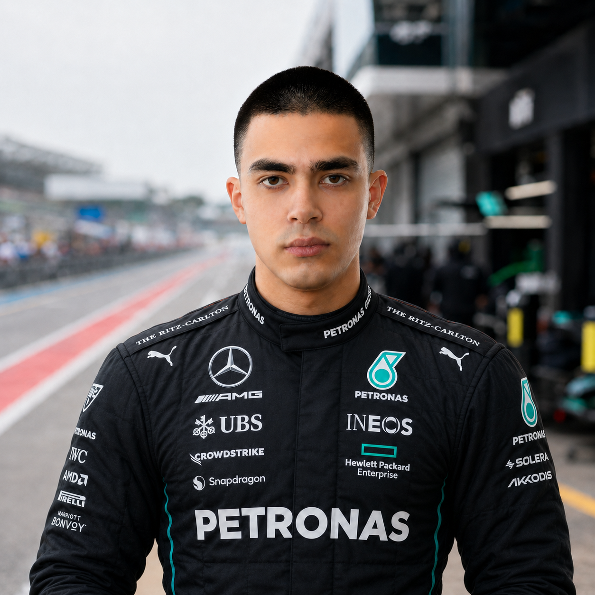
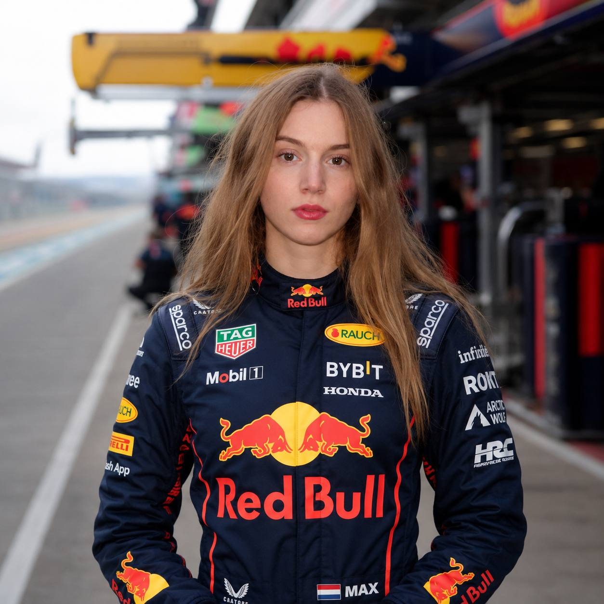
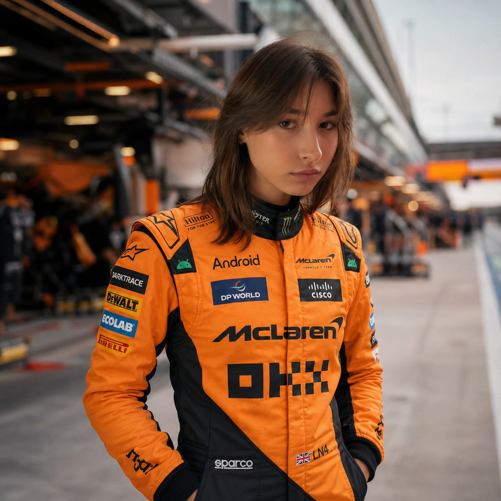

# F1 ML Analytics & Notifications

<table>
  <tr>
    <td align="center">
       
      <b>Павлов Тимур</b>
    </td>
    <td align="center">
       
      <b>Архипова Арина</b>
    </td>
    <td align="center">
       
      <b>Радькова Полина</b>
    </td>
    <td align="center">
       
      <b>Абрамов Матвей</b>
    </td>
    <td align="center">
       
      <b>Винокуров Тимофей</b>
    </td>
  </tr>
</table>

Командный проект по интеллектуальному анализу данных: система машинного обучения для аналитики Формулы-1 и персонализированной доставки гоночных уведомлений.

Проект объединяет две связанные бизнес-задачи:

1. **Предсказание исхода гонки до старта** — модель оценивает финишную позицию пилотов, порядок финиша и вероятность попадания в топ-N.
2. **Классификация системных сообщений Формулы-1** — модель определяет тип входящего live-сообщения гонки и помогает боту отправлять пользователю только те события, на которые он подписан.

Итоговая идея проекта: дать болельщику и аналитическому клиенту не просто поток сырых сообщений, а персонализированный F1-сервис, который до гонки показывает прогноз, а во время гонки фильтрует важные события по интересам пользователя.

## 1. Бизнес-контекст

Формула-1 генерирует большое количество данных до, во время и после гоночного уикенда: результаты квалификаций, темп пилотов, погодные условия, историю выступлений, live-сообщения race control, статусы сессий, флаги, safety car, штрафы и другие события.

Для обычного болельщика такой поток данных часто избыточен: кому-то важны только флаги и safety car, кому-то — штрафы, кому-то — события вокруг конкретного пилота или команды. Для бизнес-клиента ценность заключается в том, чтобы получить понятный прогноз перед гонкой и релевантные уведомления во время гонки.

Проект решает эту проблему через две ML-компоненты:

- **pre-race analytics** — прогноз исхода гонки на основе данных, известных до старта;
- **live notification intelligence** — классификация входящих системных сообщений и персонализация уведомлений в боте.

## 2. Бизнес-задачи

### 2.1. Задача 1: прогноз результатов гонки

**Что решаем.** По стартовой позиции из квалификации, форме пилота и команды, истории на трассе, надежности, опыту, погоде и другим признакам предсказываем, как пилоты финишируют в гонке.

**Кому это полезно:**

- болельщикам Формулы-1 — для превью гонки и понимания вероятных сценариев;
- аналитикам и медиа — для подготовки предгоночного контента;
- fantasy F1 и ставочным аналитикам — для оценки победителя, подиума, топ-10 и дуэлей пилотов;
- командам и исследователям — для анализа факторов, влияющих на результат.

**ML-постановки:**

| Подзадача            | Формулировка                               | Бизнес-смысл                               |
| -------------------- | ------------------------------------------ | ------------------------------------------ |
| Регрессия            | Предсказать финишную позицию пилота        | Оценить ожидаемый результат каждого пилота |
| Ранжирование         | Упорядочить пилотов внутри гонки           | Получить прогноз итогового протокола       |
| Мягкая классификация | Оценить вероятность топ-1 / топ-3 / топ-10 | Показать вероятность ключевых исходов      |

---

### 2.2. Задача 2: классификация системных сообщений F1

**Что решаем.** Во время гонки появляются системные сообщения: показан флаг, выпущен safety car, объявлен virtual safety car, начато расследование, выдан штраф, изменен статус сессии и т.д. ML-модель получает текст такого сообщения и классифицирует его по одному из шести типов событий.

**Бизнес-сценарий.** Пользователь взаимодействует с ботом и выбирает, какие типы событий ему интересны. Когда приходит новое сообщение, модель определяет его класс. Если этот класс входит в фильтр пользователя, бот отправляет уведомление; если нет — сообщение скрывается.

**Пример пользовательского сценария:**

1. Пользователь открывает бота.
2. Выбирает интересующие типы событий: например, `Flag`, `SafetyCar`, `CarEvent` и др..
3. Во время гонки в систему поступает сообщение: `SAFETY CAR DEPLOYED`.
4. Модель классифицирует сообщение как `SafetyCar`.
5. Бот проверяет подписку пользователя.
6. Если пользователь подписан на этот тип событий, бот отправляет уведомление.

**Классы событий:**

| Класс           | Описание                                      |
| --------------- | --------------------------------------------- |
| `Flag`          | Флаги и сигналы на трассе                     |
| `SafetyCar`     | Safety Car и Virtual Safety Car               |
| `CarEvent`      | События по определенной машине                |
| `Drs`           | Информация про статус DRS системы             |
| `SessionStatus` | Статусы сессии и общие race control сообщения |
| `Other`         | Инциденты на трассе                           |

## 3. Как решение встраивается в бизнес-процесс

**Бизнес-ценность:**

- пользователь получает меньше информационного шума
- бот становится персонализированным, а не просто пересылает все события подряд
- прогнозная модель повышает ценность продукта до начала гонки
- классификатор live-сообщений повышает ценность продукта во время гонки
- обе модели вместе формируют единую аналитику для F1-аудитории

## 4. Данные

Для решения задания используется источник **OpenF1 API**

### 4.1. Данные для прогноза гонки

**Целевая переменная:**

- `position_filled` — финишная позиция пилота; для DNF/DNS/DSQ используется последнее место.

**Основные признаки:**

| Группа признаков  | Примеры                                                                                |
| ----------------- | -------------------------------------------------------------------------------------- |
| Квалификация      | `quali_position`                                                                       |
| Форма пилота      | `driver_form_5`, `driver_form_all`                                                     |
| Форма команды     | `team_form_5`                                                                          |
| История на трассе | `driver_track_history`                                                                 |
| Надежность        | `driver_finish_rate`                                                                   |
| Опыт              | `driver_experience`, `is_rookie`                                                       |
| Темп              | `driver_speed_5`                                                                       |
| Погода            | `air_temp_mean`, `track_temp_mean`, `humidity_mean`, `wind_speed_mean`, `rainfall_max` |
| Категории         | `team_name`, `circuit_short_name`, `circuit_type`                                      |

Признаки формы считаются только по прошлым гонкам через хронологическую сортировку и `shift(1)`, чтобы избежать утечки данных из будущего.

### 4.2. Данные для классификации сообщений

Для второй задачи используется датасет системных сообщений Формулы-1. Каждая строка соответствует одному входящему сообщению race control или live-ленты.

**Целевая переменная:**

- `category` — один из шести классов событий: `Flag`, `SafetyCar`, `CarEvent`, `Drs`, `SessionStatus`, `Other`.

**Предобработка текста:**

- приведение текста к единому регистру
- удаление лишних символов, знаков препинания, цифр
- векторизация текста через TF-IDF
- кодирование целевого класса.

## 5. Методология

### 5.1. Модели для прогноза гонки

| Тип модели             | Модель                  | Назначение                                |
| ---------------------- | ----------------------- | ----------------------------------------- |
| Линейная модель        | `LinearRegression`      | базовая интерпретируемая регрессия        |
| Метрическая модель     | `KNeighborsRegressor`   | сравнение с локальным подходом            |
| Метод опорных векторов | `SVR`                   | нелинейная регрессия                      |
| Дерево решений         | `DecisionTreeRegressor` | интерпретируемая нелинейная модель        |
| Бэггинг                | `RandomForestRegressor` | устойчивый ансамбль деревьев              |
| Бустинг                | `CatBoostRegressor`     | сильная модель для табличных данных       |
| Learning-to-rank       | `CatBoostRanker`        | предсказание порядка пилотов внутри гонки |
| Нейросеть              | MLP на PyTorch          | нелинейная модель с BatchNorm и Dropout   |
| Классификация топ-N    | `CatBoostClassifier`    | вероятности топ-1 / топ-3 / топ-10        |

**Трансформеры и обработка признаков:**

- `StandardScaler` — масштабирование числовых признаков;
- `OneHotEncoder` / `get_dummies` — кодирование категориальных признаков;
- `SelectKBest` — отбор наиболее информативных признаков;
- `PCA` — снижение размерности;
- `TimeSeriesSplit` — временная кросс-валидация;
- `GridSearchCV` и `Optuna` — подбор гиперпараметров.

### 5.2. Модели для классификации сообщений

Для задачи классификации системных сообщений строится пайплайн текстовой классификации.

## 6. Метрики качества

### 6.1. Метрики для прогноза гонки

| Тип задачи           | Метрики                                                       |
| -------------------- | ------------------------------------------------------------- |
| Регрессия позиции    | MAE, RMSE, R²                                                 |
| Ранжирование         | Spearman correlation, NDCG, accuracy победителя               |
| Бизнес-исходы        | accuracy топ-1, precision/recall для подиума, top-10 hit rate |
| Мягкая классификация | ROC-AUC, average precision, log-loss                          |

**Главная бизнес-метрика:** насколько хорошо модель помогает предсказать практически важные исходы: победитель, подиум и попадание в очки.

## 7. Результаты и интерпретация

### 7.1. Прогноз гонки

Модели позволяют получить:

- прогноз финишной позиции каждого пилота
- ранжированный список пилотов по ожидаемому результату
- вероятность победы, подиума и попадания в топ-10
- оценку влияния квалификации, формы пилота, формы команды, погоды и истории на трассе

Наиболее прикладной результат — не точное угадывание каждой позиции, а корректное определение ключевых зон: победитель, подиум, очковая зона и аутсайдеры

### 7.2. Классификация сообщений

Классификатор системных сообщений позволяет:

- автоматически определять тип live-события
- снизить информационный шум для пользователя
- отправлять только релевантные уведомления
- анализировать, какие события чаще всего происходят в конкретных гонках
- расширять бота за счет пользовательских подписок на классы событий
